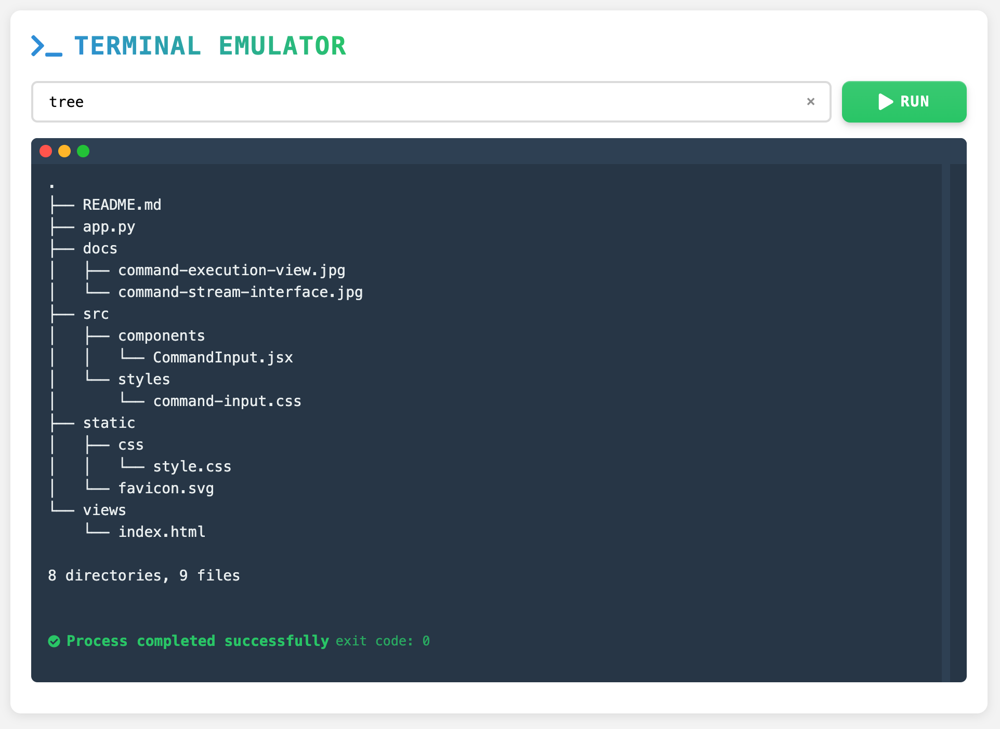
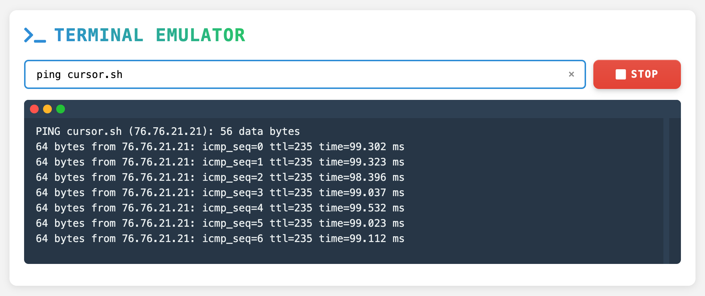

# CmdStream

CmdStream is a WebSocket-based command-line streaming tool that enables command execution and output monitoring through a web interface.

> 🤖 This project was entirely generated using [Cursor](https://cursor.sh), an AI-powered IDE.

## Features

- 🚀 Command execution with real-time output
- 💻 Modern web interface
- 🔄 WebSocket-based real-time data transmission
- 📊 Live command execution status feedback

## Tech Stack

- Backend: Python with aiohttp
- Frontend: HTML, CSS, JavaScript
- Communication: WebSocket

## Screenshot





## Quick Start

1. Install dependencies:
```bash
pip install aiohttp
```

2. Run the application:
```bash
python app.py
```

3. Open in browser: `http://localhost:8080`
